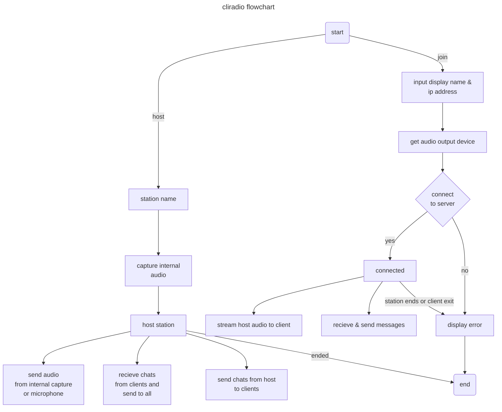

```mermaid
---
title: cliradio flowchart
---
flowchart TD
    %% host 
    A(start) -->|host| B[station name]
    B --> 
    h[capture internal 
    audio] -->
    host[host station]
    host --> 
    send[send audio 
    from internal capture
    or microphone] 
    host --> 
    chat2[recieve chats
    from clients and 
    send to all]
    host -->
    chat3[send chats from host
    to clients]
    host --> |ended| Z


    %% client
    A --> 
    |join| C[input display name & 
    ip address]
    C --> E[get audio output device] --> 
    F{connect 
    to server}
    F --> |yes| connected
    connected --> G[stream host audio to client] 
    connected --> chat[recieve & send messages]
    F --> |no| err[display error] --> Z
    connected --> |station ends or client exit| err
    Z(end)
```
